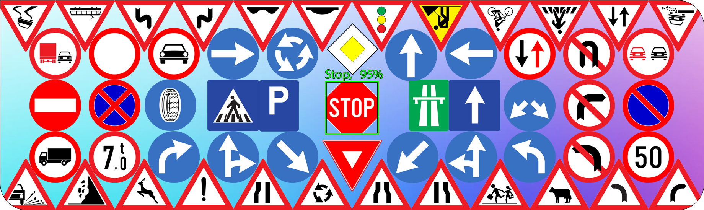

<!-- Banner -->
<div align="center">
  <p>
    <a href="https://yolovision.ultralytics.com/" target="_blank">
      </a>
  </p>

</div>


<!-- Technologies used, right under banner -->
<div align="center">
    
    
    
    <a href="https://universe.roboflow.com/radu-oprea-r4xnm/traffic-signs-hyipi">
    </img>
</a>
 </div>

<!-- Project description -->
***
<div align="center">
<h1>Traffic signs recognition</h1>
<p>Hello, this is my personal project for traffic sign recognition. The goal of the 
project was to train a model that was capable to recognize classes of signs (mandatory, forbidden,
priority etc.) or even better, specific signs like the ones from the banner image.</p>
<p>The dataset was created by me, every image was also collected and annotated by me.</p>
<p></p>
</div>


<!-- Project goals -->
<div align="left">
<h1 align="center">Goals</h1>
<p>
I started by playing around with different models and datasets and when I realised that I want 
to take this further I set some goals for myself. 
</p>
<ul>
<li>Create a dataset that contains of somewhat big and high quality images.</li>
<li>Train a model that has pretty high accuracy and can reliably detect traffic signs.</li>
<li>Use the model with high accuracy to collect more data, thus saving a lot of time.</li>
</ul>
<p>
I had a bunch of other ideas,
but this was a solid base that would eventually allow me to build upon.
</p>
</div>
<!-- Dataset -->
<div align="left">
<h1 align="center">Dataset</h1>
<p>Collecting data is not a hard task, you can find images and videos all over the internet. My 
very first thought, apart from actually going outside and taking pictures myself, was to go on 
youtube. There are millions of videos with people driving around different places. I was 
expecting a lot of videos to be of bad quality, have low framerates which meant blurry images, 
I was expecting random text and images to appear on screen because it's an edited video. I also 
realised after I started that most people had their camera inside the car which would cause 
clarity issues because of the windshield. 
</p>
<p>What I didn't expect, however, was the YouTube compression algorithm to be so aggressive. A 
1080p video looks pretty good, but it's heavily compressed. I collected around 500 pictures and I 
got some disappointing results. 
</p>
<p>It took me a while to think about Google Maps, but once I did, I knew this was going to work. 
Right now there are almost 3k pictures in the dataset most of them from Google Maps.
</p>

<p>Why most of them? Because I didn't give up on YouTube, I knew that once I can collect data 
automatically videos would be the go-to. I tried some workarounds and I figured that if I 
download a 4k 60fps video and render it to 1080p 60fps the results are better than the native 
1080p from YouTube.
</p>

<p>The dataset is now saved on RoboFlow, a pretty cool website, which was used for labeling. You 
can check a lot of stats about the dataset: classes, image size, splits, versions etc. Check the 
DOWNLOAD link below.
</p>

```link
https://universe.roboflow.com/radu-oprea-r4xnm/traffic-signs-hyipi
```

<p>The dataset is pretty skewed at the moment. Naturally some signs appear more than 
others. This can be bad but also leaves room for a lot of experiments.</p>

<p></p>
</div>

<!-- Experiments -->
<div align="left">
<h1 align="center">Experiments</h1>
<p>Training and testing a model is where the fun actually begins in machine learning. Collecting, 
cleaning and labeling data is entertaining, but there's nothing like training a model for 8 hours 
just to realize that it's bad and it's not going to get better.
</p> COMING SOON
<p>
</p>
</div>

<!-- Results -->
<div align="left">
<h1 align="center">Results</h1>
<p> COMING SOON
</p>
</div>

<!-- Documentation -->

